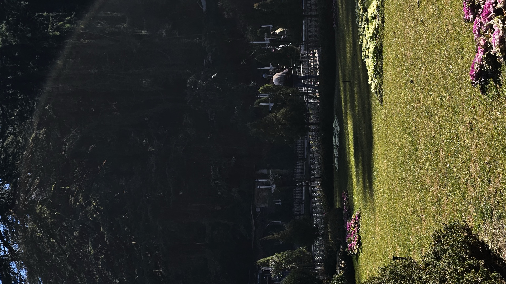

# Tanishq Pandey — Personal Photography Archive

> A bespoke, high-performance personal photography portfolio website engineered around the interactive **Scroll Fan Cards** radial aperture experience, an ambient **WebGL Chromatic Dispersion Ribbon**, and a 49-photograph archive with authentic camera EXIF exposure metadata.



---

## Table of Contents
1. [Overview & Concept](#overview--concept)
2. [Key Features](#key-features)
   - [Interactive Scroll Fan Cards](#1-interactive-scroll-fan-cards)
   - [Ambient WebGL Chromatic Dispersion Ribbon](#2-ambient-webgl-chromatic-dispersion-ribbon)
   - [Curated 49-Photo Archive & Multi-View Switcher](#3-curated-49-photo-archive--multi-view-switcher)
   - [Fullscreen Technical EXIF Lightbox](#4-fullscreen-technical-exif-lightbox)
   - [Personal Bio, Gear Setup & Contact](#5-personal-bio-gear-setup--contact)
   - [Full Cross-Device Responsive Design](#6-full-cross-device-responsive-design)
3. [Technology Stack](#technology-stack)
4. [Project Structure](#project-structure)
5. [Customizing Content](#customizing-content)
   - [Editing Bio, Socials & Gear](#editing-bio-socials--gear)
   - [Adding New Photos via Automated Script](#adding-new-photos-via-automated-script)
6. [Deployment to Vercel](#deployment-to-vercel)
   - [Method 1: GitHub Continuous Deployment (Recommended)](#method-1-github-continuous-deployment-recommended)
   - [Method 2: Vercel CLI](#method-2-vercel-cli)
   - [Method 3: Vercel Web Dashboard (Drag & Drop)](#method-3-vercel-web-dashboard-drag--drop)
7. [Running Locally](#running-locally)
8. [License & Credits](#license--credits)

---

## Overview & Concept

This portfolio was designed and built specifically as a **personal visual diary and photography archive** for **Tanishq Pandey**. It marries high-editorial typography (`Instrument Serif` & `Plus Jakarta Sans`) with futuristic optics and interactive physics.

Rather than a static grid of thumbnails, the homepage opens with an interactive **Scroll Fan Cards** deck: as visitors scroll down the page, a neatly stacked deck of photographs smoothly opens outward into a 360° circular fan, rotating like the aperture blades of an analog camera lens.

---

## Key Features

### 1. Interactive Scroll Fan Cards
- **Aperture Wheel Mathematics**: Implements radial card distribution using:
  $$\text{angle}(i, \text{total}) = -60^\circ + \left(\frac{360^\circ}{\text{total}}\right) \times i$$
  with `transform-origin: left bottom` and centered stack offset compensation.
- **Scroll Synchronization**: Card spread smoothly responds to page scroll using lerp spring interpolation ($0.0$ stacked deck $\rightarrow$ $1.0$ circular pinwheel $\rightarrow$ $1.0+$ continuous aperture spin).
- **Interactive Drag & Swipe**: Visitors can click and drag horizontally (or touch swipe on phones) to spin the card wheel freely.
- **Floating Control Deck**:
  - **Stack / Fan Scrub Slider**: Manually scrub card spread.
  - **Spread Toggle**: Instantly snap between stacked and fanned states.
  - **Auto-Spin Mode**: Automatic slow rotation for hands-free showcase.
  - **Prism Glow Toggle**: Enable or disable the ambient background shader ribbon.
- **Micro-Interactions**: High-gloss glass reflections (`linear-gradient(135deg, rgba(255,255,255,0.32) 0%, rgba(255,255,255,0.05) 45%, transparent 100%)`), hover elevation with radial lift, and instant title badges.

### 2. Ambient WebGL Chromatic Dispersion Ribbon
- Powered by raw GLSL fragment and vertex shaders.
- Generates fluid trigonometric distortion waves:
  ```glsl
  vec2 distort(vec2 p, float offset) {
      p += offset + (u_mouse - 0.5) * 0.15;
      for (float i = 1.0; i < 4.0; i++) {
          p.x += 0.3 / i * sin(i * 3.0 * p.y + u_time);
          p.y += 0.3 / i * cos(i * 3.0 * p.x + u_time);
      }
      return p;
  }
  ```
- Separates red, green, and blue channels ($0.0$, $0.02$, $0.04$) to produce authentic chromatic dispersion against a pitch-black obsidian void (`#050505`).
- Interactively bends toward the visitor's mouse or touch position.

### 3. Curated 49-Photo Archive & Multi-View Switcher
- Features 49 real photographs taken by Tanishq across New Delhi, travels, and architectural studies.
- **Dual-Tier Image Optimization**:
  - `assets/images/full/`: 1920px crisp web-optimized JPEGs for high-DPI displays.
  - `assets/images/thumbs/`: 720px lightweight thumbnails ensuring 60fps animations and instant initial page load.
- **Category Filter Pills**:
  - `All (49)`
  - `Editorial`
  - `Street & Nocturne`
  - `Architecture & Form`
  - `Nature & Landscape`
  - `Analog & Film`
- **Layout Switchers**:
  - **Masonry Grid**: Fluid asymmetric editorial layout with subtle zoom on hover.
  - **Filmstrip Mode**: Horizontal momentum-scroll contact strip.
  - **Index List**: Minimalist typographic catalog table with EXIF indicator chips.

### 4. Fullscreen Technical EXIF Lightbox
- Cinematic darkroom theater viewer.
- **Real Camera EXIF Drawer**: Displays authentic exposure metadata extracted from each photograph:
  - **Camera Body**: Samsung Galaxy S23, Apple iPhone 16 Plus, iPhone 12.
  - **Focal Length**: 7.0mm, 24mm equivalent, 13mm ultra-wide.
  - **Aperture**: $f/1.6$, $f/1.8$, $f/2.4$.
  - **Shutter Speed**: $1/1050\text{s}$, $1/2775\text{s}$, $1/120\text{s}$.
  - **Sensitivity**: ISO 25, ISO 50, ISO 100.
  - **Capture Date**: Exact timestamp.
- **Navigation Controls**:
  - Keyboard: `ArrowLeft` (previous), `ArrowRight` (next), `Escape` (close).
  - Touch: Swipe left or right on mobile/tablet screens.
  - Navigation buttons and backdrop click-to-close.

### 5. Personal Bio, Gear Setup & Contact
- Narrative statement framing photography as a personal visual diary and way of seeing.
- **My Gear & Setup**: Highlights everyday camera systems and optical prism filters.
- **Say Hello Modal**: A clean personal contact modal allowing friends, fellow photographers, or collaborators to connect.
- Connected directly to Instagram [**@taxisxhqqq**](https://www.instagram.com/taxisxhqqq/) and email [**pandeytanish53@gmail.com**](mailto:pandeytanish53@gmail.com).

### 6. Full Cross-Device Responsive Design
- **Smartphones (iPhone SE, 14/15/16, Androids)**:
  - Dynamically calculates fan card dimensions (`widthRatio = 0.88`, `heightRatio = 0.44`) so the circular fan never clips screen edges.
  - Slide-down glassmorphic mobile navigation drawer with animated hamburger toggle.
  - Horizontal swipeable category filter bar.
  - Single-column masonry feed with touch-friendly lightbox HUD.
- **Tablets & iPads**:
  - Balanced 2-column grid and proportional card fan radius.
- **Laptops (13" to 16" screens, MacBook Air/Pro)**:
  - Optimized vertical spacing to keep the fan deck, typography, and controls in a single cohesive viewport.
- **Large Monitors (1440p / 4K / Ultrawides)**:
  - High-res asset scaling and multi-column grid expansion.

---

## Technology Stack

- **Markup**: Pure HTML5 (Semantic, accessible, SEO meta tags, Open Graph cards).
- **Styling**: Vanilla CSS3 (Custom properties, CSS Grid, Flexbox, glassmorphism, responsive media queries).
- **Interactive Engines**: Vanilla JavaScript (ES6+ Modules).
- **Graphics**: Raw WebGL (GLSL Shaders for chromatic dispersion).
- **Dependencies**: **Zero** external libraries or node runtime dependencies. Fast, lightweight, and works in any modern web browser.

---

## Project Structure

```
Photography Portfolio/
├── index.html                   # Main single-page application entry point
├── vercel.json                  # Vercel deployment & immutable asset cache rules
├── .gitignore                   # Excludes logs, OS cache, and raw temp files
├── README.md                    # Comprehensive documentation & deployment guide
├── assets/
│   ├── css/
│   │   └── style.css            # Dark aesthetic, glassmorphic UI, responsive styles
│   ├── js/
│   │   ├── fan-cards.js         # Scroll Fan Cards mathematical & physics engine
│   │   ├── shader.js            # Ambient WebGL chromatic dispersion ribbon shader
│   │   ├── portfolio-data.js    # 49-photo catalog with real technical EXIF metadata
│   │   └── app.js               # Main orchestrator (filters, lightbox, mobile drawer)
│   └── images/
│       ├── full/                # 49 web-optimized high-resolution JPEGs (1920px max)
│       └── thumbs/              # 49 lightweight thumbnails (720px max)
└── scripts/
    └── process_photos.py        # Re-runnable batch converter for future photo additions
```

---

## Customizing Content

### Editing Bio, Socials & Gear
All portfolio metadata is centralized in [`assets/js/portfolio-data.js`](assets/js/portfolio-data.js):
```javascript
export const PORTFOLIO_CONFIG = {
  photographer: "Tanishq Pandey",
  tagline: "Personal Photography & Visual Archive",
  location: "New Delhi",
  bio: "A personal visual diary capturing light, architecture, candid moments, and everyday perspectives.",
  year: "2024–2026",
  socials: {
    instagram: "https://www.instagram.com/taxisxhqqq/",
    email: "pandeytanish53@gmail.com"
  },
  gear: [
    { name: "Apple iPhone 16 Plus", desc: "48MP Fusion Camera, 24mm f/1.6, Sensor-shift OIS" },
    { name: "Samsung Galaxy S23", desc: "50MP Dual Pixel, 3x Telephoto f/2.4, Nightography" },
    { name: "Apple iPhone 12", desc: "Ultra-wide 13mm f/2.4, Deep Fusion" },
    { name: "Prime Glass & Filters", desc: "Prism dispersion filters, CPL & Black Mist diffusion" }
  ]
};
```

### Adding New Photos via Automated Script
Whenever you take new photos and want to add them to your portfolio:
1. Place your new `.heic` or `.jpg` photos into your photo folder.
2. In `scripts/process_photos.py`, confirm `SOURCE_DIR` points to your folder.
3. Run:
   ```bash
   python3 scripts/process_photos.py
   ```
4. The script will automatically:
   - Convert images to web-optimized JPEGs (both full-size and thumbnails).
   - Extract real EXIF metadata (camera, focal length, aperture, shutter, ISO, date).
   - Update `assets/js/portfolio-data.js` automatically.

---

## Deployment to Vercel

The project includes [`vercel.json`](vercel.json) pre-configured with caching headers for fast global CDN distribution.

### Method 1: GitHub Continuous Deployment (Recommended)
Because your repository is already linked to:
`https://github.com/tanishq-pandey5/Tanishq-s-Photograpy-Portfolio.git`

1. Push your latest code:
   ```bash
   git push origin main
   ```
2. Go to [vercel.com/new](https://vercel.com/new).
3. Connect your GitHub account and import **`Tanishq-s-Photograpy-Portfolio`**.
4. In the project settings, leave all default settings (Framework Preset: *Other*, Root Directory: `./`).
5. Click **Deploy**.
6. Vercel will deploy your portfolio in ~20 seconds and assign a live URL (e.g. `https://tanishq-s-photograpy-portfolio.vercel.app`).
   *Every time you push new photos or changes to GitHub, Vercel will automatically re-deploy your site!*

---

### Method 2: Vercel CLI
If you prefer deploying directly from your terminal:
```bash
npx vercel
```
1. Press `y` to confirm deployment.
2. Select your personal Vercel account.
3. Link to existing project? Choose `N` (or link if already created).
4. Project name: `tanishq-photography` (or press Enter).
5. Directory: `./` (press Enter).
6. To deploy straight to production:
   ```bash
   npx vercel --prod
   ```

---

### Method 3: Vercel Web Dashboard (Drag & Drop)
1. Go to [vercel.com/new](https://vercel.com/new).
2. Under "Deploy without Git", drag and drop this entire project folder into the browser window.
3. Click **Deploy**.

---

## Running Locally

To preview and test the site locally on your computer:

```bash
# Using Python built-in server:
python3 -m http.server 8088
```
Then open your browser and navigate to:
**`http://localhost:8088/`**

You can also test responsiveness by opening Chrome or Safari DevTools (`Cmd + Option + I`) and toggling the device simulator (iPhone, iPad, MacBook).

---

## License & Credits

- **Photographs**: © 2024–2026 Tanishq Pandey. All personal photography rights reserved.
- **Typography**: [Instrument Serif](https://fonts.google.com/specimen/Instrument+Serif) and [Plus Jakarta Sans](https://fonts.google.com/specimen/Plus+Jakarta+Sans) via Google Fonts.
- **Inspirations**: Framer aperture card radial math & GLSL chromatic dispersion shader experiments.
